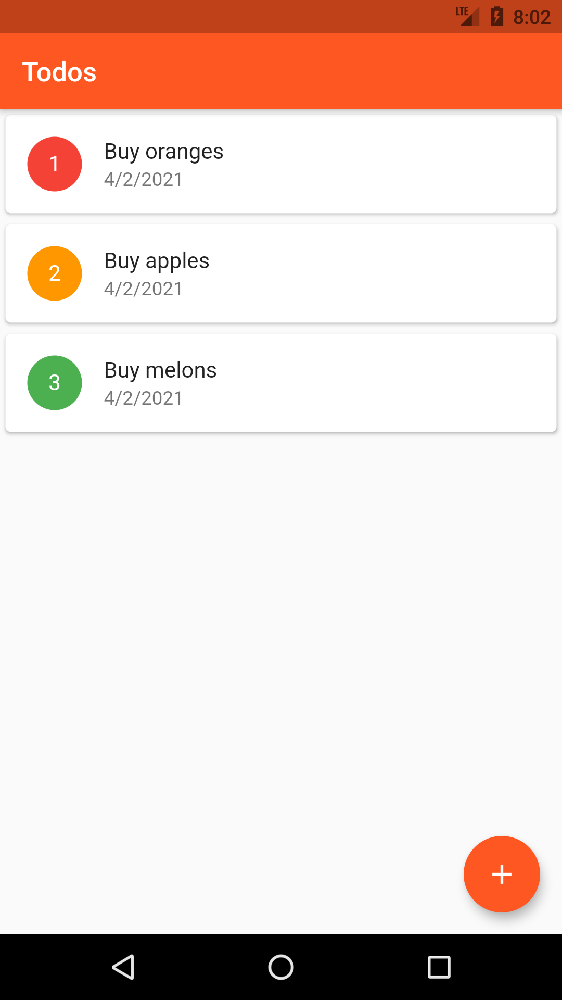
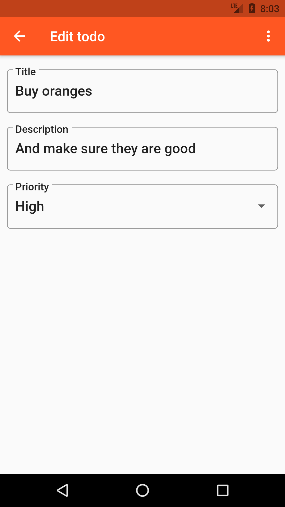

# Todo List App

This is a simple todo list app written in Flutter. It's part of the Flutter: Getting Started course, available on PluralSight.

The todo items are saved on a SQLite database, using the SQFLite library.

## Screenshots

| Homepage                 | Details                  |
:-------------------------:|:-------------------------:
|  |  |
